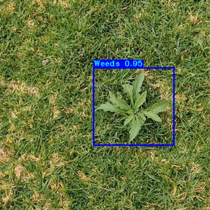
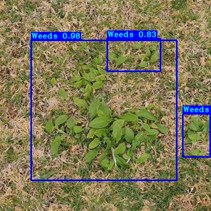
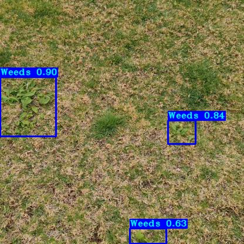
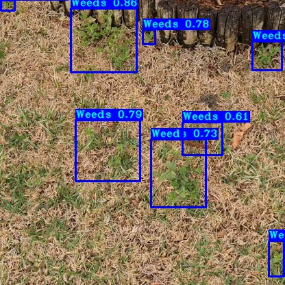
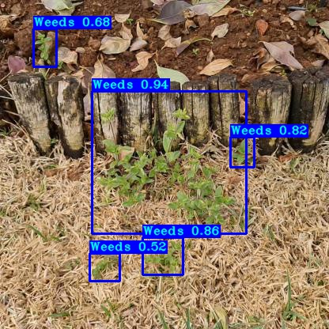
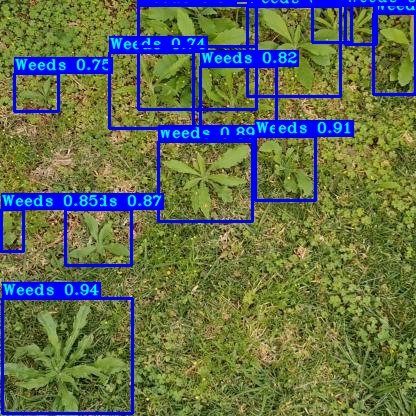
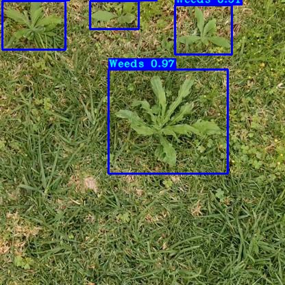
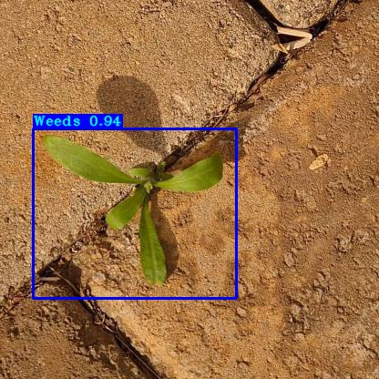

# Weed Detection for Agriculture 🌱

## Project Description

This project is a prove of concept for weed detection in agriculture. 

The model is trained on a collection of garden weed images from the [Weeds dataset](https://universe.roboflow.com/augmented-startups/weeds-nxe1w), making it capable of detecting weeds that typically blend in with their surroundings and confuse other detection models.

The tensorflow implementation of the Yolo model is taken and modified from the following repository:
https://github.com/pythonlessons/TensorFlow-2.x-YOLOv3.git
🙌

## Dataset
Downlaod the data [Weeds dataset](https://universe.roboflow.com/augmented-startups/weeds-nxe1w) in COCO format and extract it to the data folder. You might need to adjust the paths in the config file.

## Training
To train the model run the following file:

`train.py`

## Inference
To run inference on a folder of .jpg images run the following file:
`detect_herbs.py`

You might need to adjust the weight the paths in the config file.

## Results
Some test set results after 5 epochs with 96.035% mAP:

<table>
<tr>
<td>

</td>
<td>

</td>
</tr>
<tr>
<td>

</td>
<td>

</td>
</tr>
<tr>
<td>

</td>
<td>

</td>
</tr>
<tr>
<td>

</td>
<td>

</td>
</tr>
</table>